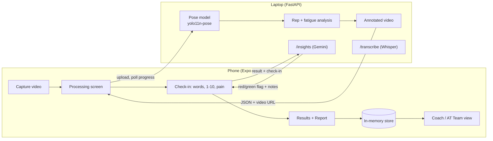
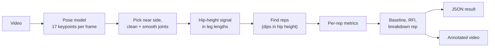
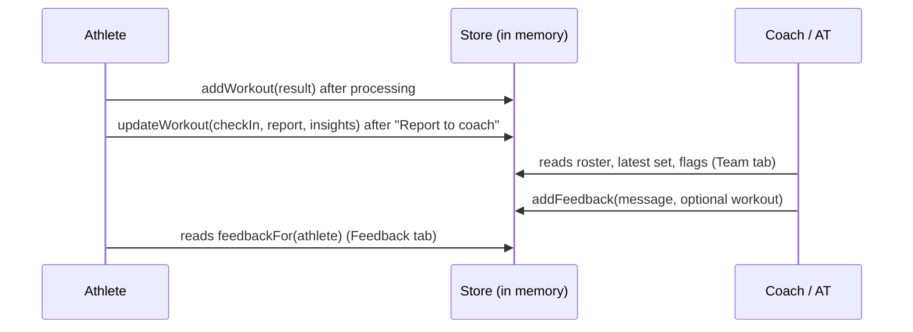

# BreakPoint Developer Guide

How the app and server fit together: what happens to a squat video from the moment it is picked to the moment a coach reads about it.

The [main README](../README.md) covers what the product is for, the RFI formula and how to run everything. This guide covers how the code works.

## Contents

1. [The big picture](#1-the-big-picture)
2. [Frontend (Expo app)](#2-frontend-expo-app)
3. [Light and dark mode](#3-light-and-dark-mode)
4. [Backend (FastAPI server)](#4-backend-fastapi-server)
5. [The AI parts](#5-the-ai-parts)
6. [How something gets flagged](#6-how-something-gets-flagged)
7. [How results reach coaches and athletic trainers](#7-how-results-reach-coaches-and-athletic-trainers)
8. [How the graphs are made](#8-how-the-graphs-are-made)
9. [What works offline](#9-what-works-offline)
10. [How it was developed](#10-how-it-was-developed)
11. [Known gaps](#11-known-gaps)

---

## 1. The big picture

There are two programs:

- **The app** (`src/`): an Expo / React Native app that runs on the phone (or web). It handles sign-in, recording, charts, check-ins and coach feedback.
- **The server** (`code/` and `server/`): a Python FastAPI process on a laptop. It runs the pose model on the video, does the fatigue maths, draws the annotated video and hosts the AI routes.

The phone talks to the server over the local network at `EXPO_PUBLIC_API_URL`. Nothing runs in the cloud except the optional Gemini call.

One analyzed set moves through the app like this:

| Step | Screen | What happens |
|---|---|---|
| 1 | Capture ([capture.tsx](../src/app/(student)/capture.tsx)) | Athlete records or picks a video, or chooses the demo. |
| 2 | Processing ([processing.tsx](../src/app/processing.tsx)) | Video is uploaded; the server's progress is polled and shown as 0-100%. |
| 3 | Reflect ([reflect.tsx](../src/app/reflect.tsx)) | Before seeing numbers, the athlete describes the set, rates exhaustion 1-10 and answers the pain question. |
| 4 | Results ([results/[id].tsx](../src/app/results/[id].tsx)) | Video, breakdown rep, charts, rep table, AI summary. |
| 5 | Report ([report.tsx](../src/app/(student)/report.tsx)) | Measured vs reported effort, plus messages for athlete, coach and trainer. |
| 6 | Team ([athletes.tsx](../src/app/(coach)/athletes.tsx)) | Coaches and ATs see traffic lights, flags and can leave feedback. |

---

## 2. Frontend (Expo app)

### Stack

| Need | Library |
|---|---|
| Framework | Expo SDK 57, React Native 0.86 |
| Navigation | Expo Router (file-based routes in `src/app/`) |
| Shared state | `zustand` ([store.ts](../src/data/store.ts)) |
| Charts | `react-native-svg`, hand-drawn ([charts.tsx](../src/components/charts.tsx)) |
| Video pick / record | `expo-image-picker` |
| Video playback | `expo-video` ([result-video.tsx](../src/components/result-video.tsx)) |
| Voice input | `expo-audio` + optional `expo-speech-recognition` ([use-dictation.ts](../src/hooks/use-dictation.ts)) |
| Exhaustion slider | `@react-native-community/slider` |

### Navigation and roles

Every file in `src/app/` is a screen. The root [\_layout.tsx](../src/app/_layout.tsx) is a stack. Two tab groups hang off it:

- `(student)/`: **Results, Capture, Report, Feedback** tabs for athletes.
- `(coach)/`: **Team, Feedback** tabs for coaches *and* athletic trainers. The two staff roles see the same screens; only the title ("Coach Smith" vs "AT Smith") differs.

Shared screens outside the tabs: `processing`, `reflect` (a modal), `results/[id]`, `athlete/[id]` (staff view of one athlete) and `resources`.

**Sign-in** ([index.tsx](../src/app/index.tsx)) has no real authentication. Any email and password are accepted. The name is derived from the email (`jadan.baugh@ufl.edu` → "Jadan Baugh") and stored in the `session` object. An athlete whose name matches the roster gets that roster entry; otherwise a new athlete is added.

### State

[store.ts](../src/data/store.ts) holds everything in one zustand store:

- `athletes`: the department roster. Each athlete has `workouts`, newest first. The football roster is pre-filled with 1-8 **sample sets** per player from [sample-workouts.ts](../src/data/sample-workouts.ts), so the staff dashboard has varied RFIs, flags and workout counts to show. The samples run through the same fatigue maths and flag rules as real check-ins, and are seeded by athlete, so they are the same on every launch.
- `feedback`: coach/AT messages, optionally tied to one workout.

A `Workout` ([squat-types.ts](../src/lib/squat-types.ts)) bundles the server's `result` with the athlete's `checkIn`, the `report` and the AI `insights`.

The store is **in memory only**. It is cleared when the app restarts, and it is not shared between devices (see [section 7](#7-how-results-reach-coaches-and-athletic-trainers)).

### Where the logic lives

| File | Job |
|---|---|
| [services/api.ts](../src/services/api.ts) | Every server call, plus checking that responses have the expected fields. |
| [services/squat-analysis.ts](../src/services/squat-analysis.ts) | Drives the processing screen: upload, progress, demo mode, revealing reps one by one. |
| [lib/config.ts](../src/lib/config.ts) | App-side thresholds (traffic lights, hidden overwork, mismatch gap). |
| [lib/fatigue.ts](../src/lib/fatigue.ts) | Traffic-light status, expected effort, mismatch status, template report messages. |
| [lib/insights.ts](../src/lib/insights.ts) | Rule-based version of the AI analyzer, and the red-flag rules. |
| [lib/metrics.ts](../src/lib/metrics.ts) | Formatting helpers only. |

---

## 3. Light and dark mode

The app follows the phone's system setting (`"userInterfaceStyle": "automatic"` in [app.json](../app.json)). There is no in-app toggle.

How it is wired:

1. **Colour tokens.** [theme.ts](../src/constants/theme.ts) defines `Colors.light` and `Colors.dark` with the same keys: `background`, `text`, `primary`, `accent`, `chartSeries`, `statusGreen`, and so on. The palette is UF blue (`#0021A5`) with a pastel UF orange (`#FFB27D`).
2. **`useTheme()`** ([use-theme.ts](../src/hooks/use-theme.ts)) reads the system scheme and returns the matching colour set.
3. **Components ask for tokens, never hex codes.** For example, `style={{ backgroundColor: theme.backgroundElement }}`. [ThemedText](../src/components/themed-text.tsx) does this for text, with an optional `themeColor` such as `textSecondary`.
4. **Navigation chrome** (headers, tab bars) gets React Navigation's `DarkTheme` / `DefaultTheme` through the `ThemeProvider` in the root layout, and the tab layouts pass theme colours to the tab bar.
5. **Web** uses [use-color-scheme.web.ts](../src/hooks/use-color-scheme.web.ts), which reports `light` until the page has hydrated so the server-rendered HTML and the first client render match.

Some colours stay the same in both modes on purpose: the blue hero headers and the orange accent, which are brand colours.

The traffic-light colours are always paired with a text label ("Healthy", "Caution", "Fatigued"), so colour is never the only signal. The chart colours were checked for contrast against each mode's card colour.

**To add a colour:** add the key to both `light` and `dark` in `theme.ts`. TypeScript's `ThemeColor` type only accepts keys that exist in both.

---

## 4. Backend (FastAPI server)

### Routes

All routes are in [code/api/main.py](../code/api/main.py), and the AI extras in [server/breakpoint_extras.py](../server/breakpoint_extras.py) are mounted into it automatically if their packages are installed.

| Route | Purpose |
|---|---|
| `GET /health` | Is the server up, and which model is it serving. |
| `POST /analyze/jobs` | Starts an analysis in a background thread; returns `job_id`. |
| `GET /analyze/jobs/{id}` | Progress (`stage`, `progress` 0-1), then the result or an error. The app polls this every 400 ms. |
| `POST /analyze` | Older blocking version; the app falls back to it if the job routes are missing. |
| `GET /videos/...` | Serves the annotated videos. |
| `POST /report` | Mismatch check and athlete/coach/trainer messages (see [known gaps](#11-known-gaps)). |
| `POST /insights` | AI analyzer (Gemini). |
| `POST /transcribe` | Voice clip to text (Whisper). |

Only one analysis runs at a time; the model is loaded once and reused.

### The analysis pipeline

| Step | File | What it does |
|---|---|---|
| Pose | [run_pose.py](../code/run_pose.py), [pose_backends/](../code/pose_backends/) | Runs the model on every frame (resampled to at most 30 fps). Every model family is converted to the same 17 COCO keypoints with a confidence each. If several people are visible, the largest, most confident one is used. |
| Clean | [signals.py](../code/analysis/signals.py), [filters.py](../code/common/filters.py) | Uses whichever side of the body (left or right) the camera sees best. Low-confidence points are dropped, short gaps (up to 0.6 s) are filled in, and the track is smoothed. If more than 30% of a joint is missing the server refuses rather than guesses. |
| Hip signal | [signals.py](../code/analysis/signals.py) | Hip height relative to standing, divided by leg length. Dividing by leg length means distance from the camera doesn't matter. |
| Reps | [reps.py](../code/analysis/reps.py) | Each squat bottom is a clear dip in hip height (at least 0.25 leg lengths). A rep runs from standing, to the bottom, back to standing. Reps that are too short, too long or too shallow are kept but marked not clean. |
| Metrics | [metrics.py](../code/analysis/metrics.py) | Tempo, descent/ascent time, depth, ascent speed, peak speed, minimum knee angle, hip-vs-knee height at the bottom. Also up to two short form cues per rep. |
| Fatigue | [fatigue.py](../code/analysis/fatigue.py) | Baseline = median of the first 3 clean reps. Each rep's drift toward "tired" (slower, shallower, slower rise) becomes RFI 0-100 (formula in the [README](../README.md#analysis-specification)). Needs at least 5 clean reps. |
| Assemble | [pipeline.py](../code/analysis/pipeline.py) | Builds the JSON, including a video-quality score and warnings. |
| Video | [render_overlay.py](../code/render_overlay.py) | Draws the skeleton, knee angle, and a text bar with rep number, tempo, depth, RFI and form cues, coloured by rep status. |

All thresholds are in [config.yaml](../code/config.yaml). [config_tuned.yaml](../code/config_tuned.yaml) is merged on top of it at load time.

When the video can't be analyzed (no reps, athlete lost, too few clean reps), the server returns a 422 error with a plain message, and the app shows it on the processing screen with an option to use the demo video.

---

## 5. The AI parts

There are three separate AI pieces. None of them decides whether an athlete is flagged on its own (see [section 6](#6-how-something-gets-flagged)).

### Pose estimation (always on)

`yolo11n-pose` from Ultralytics finds the body keypoints. It runs on CPU, or CUDA if available. How it was chosen is in [section 10](#10-how-it-was-developed).

### AI analyzer: `POST /insights` (Gemini, optional)

Needs `GEMINI_API_KEY` on the server. The default model is `gemini-2.5-flash`; set `GEMINI_MODEL` to change it.

1. The server turns the result into a small set of facts, such as the breakdown rep, % depth drop after it, % slower rise, peak and overall RFI, and the expected exhaustion (RFI ÷ 10).
2. It sends Gemini those facts, the athlete's 1-10 rating, pain answer and their own words. The words are wrapped in `<athlete_comment>` tags and the prompt says to treat them as data, not instructions.
3. Gemini must answer in a fixed JSON shape. The main field is `self_report_aligned`: do the words, the rating and the data tell the same story? It also writes a headline, 2-4 observations, a note for the athlete and a note for staff.
4. **The rules have the final say.** If the deterministic rating check (section 6) says red, the result is red even if Gemini says it lines up. Gemini can *add* a red flag, for example "felt great" but rated 9/10, but it can never clear one. The app applies the same rule again on its side ([api.ts](../src/services/api.ts) `requestInsights`).
5. If Gemini fails for any reason (no key, quota, bad JSON), the server answers with its rule-based version instead (`source: "rules"`).

The prompt also forbids diagnosing, naming conditions, telling the athlete they are "fine", or inventing numbers. If pain was reported, the athlete note must point them to a trainer or doctor.

In the app this shows as a card labelled **GEMINI EXPLANATION** (AI) or **PLAIN-LANGUAGE SUMMARY** (rules) ([insights-view.tsx](../src/components/insights-view.tsx)). Athletes see a gentler version; staff see the red/green flag and the reason.

### Report messages: `POST /report` (optional LLM)

[messages.py](../code/analysis/messages.py) writes the athlete/coach/trainer messages from templates. If `LLM_BASE_URL` and `LLM_MODEL` are set (any OpenAI-compatible API), an LLM may rewrite them. Its output is thrown away if it breaks a guardrail, for example "you're fine", naming an injury, or not mentioning a trainer/doctor when pain was reported. Note that the app currently always uses its own templates instead (see [known gaps](#11-known-gaps)).

### Voice input: `POST /transcribe` (Whisper, optional)

The check-in and coach-feedback text boxes have a mic button ([dictation-field.tsx](../src/components/dictation-field.tsx)). In order of preference:

1. On-device speech recognition, which needs a development build because it isn't in Expo Go.
2. Record audio and send it to the server's Whisper model (`faster-whisper`, `base.en`, CPU).
3. Otherwise, voice is unavailable and the box is type-only.

---

## 6. How something gets flagged

The "Mismatch / Lines up" flag and the under/over-reporting status come from fixed formulas that give the same answer every time; an AI can only add a red flag, never clear one. The pain escalation depends only on what the athlete reports, and the AI analyzer never changes it.

| Flag | Rule | Computed in | Shown where |
|---|---|---|---|
| **Rep / set status** (Healthy · Caution · Fatigued) | App: RFI below 35 = Healthy, 35-59 = Caution, 60+ = Fatigued | [fatigue.ts](../src/lib/fatigue.ts) `rfiStatus`, cutoffs in [config.ts](../src/lib/config.ts) | Status pills on results, rep table, workout rows, Team list and counts |
| **Breakdown rep** | First rep where the smoothed RFI stays above 40 for 2 reps in a row | Server [fatigue.py](../code/analysis/fatigue.py) | Orange banner on results, shaded "Fatigue" zone on charts, chips |
| **Form cues** | Depth < 80% of baseline; rise slower than 70% of baseline rep time; knee angle under 45°; hips above knee level. Max 2 per rep. | Server [metrics.py](../code/analysis/metrics.py) | Text on the annotated video during that rep |
| **Video quality** | Warns if more than 10% of hip/knee/ankle points were uncertain, or fewer than 90% of reps tracked cleanly. "Not usable" above 30% missing or under 80% clean. | Server [pipeline.py](../code/analysis/pipeline.py) | "Video quality note" card on results |
| **Under / over-reporting** | Expected effort = RFI ÷ 10 (1-10). Reported effort 3+ below expected = under-reporting; 3+ above = over-reporting. | App [fatigue.ts](../src/lib/fatigue.ts) `mismatchStatus` | Report banner, "Under-reported" / "Over-reported" chips |
| **Hidden overwork** (the most serious case) | Set RFI above 50 **and** either exhaustion rated 3 or lower, or rated 3+ below expected | App [insights.ts](../src/lib/insights.ts) and server [breakpoint_extras.py](../server/breakpoint_extras.py) (same rule) | "Possible hidden overwork" headline, red flag |
| **Red / green flag** ("Mismatch" / "Lines up") | Red if hidden overwork, or over-reporting by 3+, **or** the athlete's words contradict the rating or data (Gemini's judgement, or keyword rules offline) | Server `/insights`, app fallback `ruleInsights` | Flag chip on staff views, red-flag alert box at the top of the Team screen |
| **Pain escalation** | Any "Yes" to pain, regardless of RFI | App [fatigue.ts](../src/lib/fatigue.ts) `templateReport` | Red escalation box on the report, "Pain reported" chip, urges trainer/doctor and urgent care for severe symptoms |

On the Team screen, an athlete counts as **flagged** if their *latest* set has pain, an under/over-reporting mismatch, or a red AI flag. The filters ("Fatigued", "Red flag, mismatch or pain", "Needs feedback") all look at the latest set only.

The offline word check ([insights.ts](../src/lib/insights.ts) `sentimentOf`) is a keyword counter that handles simple negation, so "not tired" counts as positive and "not great" as negative.

---

## 7. How results reach coaches and athletic trainers

**There is no shared database or sync.** Athletes, coaches and ATs see each other's data only because they use the same in-memory store on the same running app. In a demo that means: sign in as an athlete, analyze a set and check in, then sign out and sign in as a coach on the same device. Separate phones do not see each other's workouts or feedback, and everything is lost when the app restarts.

Within that store, the flow is:

**What the athlete sees:** their results and charts, a gentle AI summary, and the report with all three messages (athlete, coach, trainer). Every message has a Copy / share button, so it can be sent through any messaging app.

**What staff see:**
- **Team tab**: counts by status, a red-flag alert box listing athletes whose check-in doesn't match their data (with the reason), search, filters and one row per athlete with chips.
- **Athlete page** ([athlete/[id].tsx](../src/app/athlete/[id].tsx)): latest RFI, sets analyzed, average breakdown rep, a fatigue-by-session bar chart, the staff version of the AI analysis, the latest check-in report, the workout list and feedback history.
- **Results page** for any set, with the athlete's check-in and a feedback box for that workout.

**Feedback back to the athlete:** staff type or dictate a message, either general or about one of the last five workouts ([feedback-composer.tsx](../src/components/feedback-composer.tsx), [comments.tsx](../src/app/(coach)/comments.tsx)). It appears in the athlete's Feedback tab, signed "Coach Smith" or "AT Smith" and marked if it was spoken.

---

## 8. How the graphs are made

No charting library is used. [charts.tsx](../src/components/charts.tsx) draws two components, `LineChart` and `BarChart`, from basic `react-native-svg` shapes:

- **Sizing:** the chart measures its own width with `onLayout`, then maps data to pixels with simple linear scales.
- **Axes:** "nice" tick values (steps of 1, 2, 2.5 or 5 × a power of ten) are computed in `niceTicks`, with gridlines and optional axis titles.
- **Line:** one SVG `Path`. **Bars:** paths with rounded tops, dimmed when another bar is selected.
- **Fatigue zone:** when a breakdown rep is passed as `markerX`, everything after it is shaded with a dashed line labelled "Fatigue".
- **Interaction:** tap or drag anywhere; the nearest point is selected and a readout above the chart shows its value and label, for example "Rep 4 · 0:12". This uses React Native's touch responder system, with no gesture library.
- **Theme:** all colours come from `useTheme()` (`chartSeries`, `chartMarker`, `border`, `textSecondary`), so charts follow light/dark mode.

Where they are used:

| Chart | Screen | Data |
|---|---|---|
| Rep tempo (line) | Results | Seconds per rep |
| Squat depth (bars) | Results | Hip drop ÷ leg length per rep |
| Ascent speed (line) | Results | Leg lengths per second per rep |
| Live RFI (bars) | Processing | RFI of each rep as it is revealed |
| Fatigue by session (bars) | Athlete page (staff) | Overall RFI per set, oldest first |

---

## 9. What works offline

Every server call has a local fallback, so the demo never dead-ends:

| Feature | With server | Without server, or if the call fails |
|---|---|---|
| Video analysis | Real pose + analysis | **Demo video only:** a real, precomputed result and annotated video bundled in `assets/demo/` ([make_demo_bundle.py](../code/make_demo_bundle.py)) |
| AI analyzer | Gemini via `/insights` (or the server's rules if no key) | App's `ruleInsights` |
| Report messages | Intended: `/report` | App's `templateReport` |
| Voice input | Whisper via `/transcribe` | On-device recognition in a dev build, otherwise typing only |

The app's [config.ts](../src/lib/config.ts) and the server's [breakpoint_extras.py](../server/breakpoint_extras.py) contain the same red-flag rules, so the flag comes out the same whether or not the server is reachable.

---

## 10. How it was developed

What the repository records:

- **Team:** commits by Aashita Rai, Nilesh Rai and Rithika Mathew, all on 2026-10-03. The app was built first ("Build BreakPoint squat fatigue app"), then the backend was added, then the video annotations and an RFI fix.
- **Starting point:** the app began from the Expo default template, which is where the `ThemedText`, `useTheme`, `useColorScheme` and web hydration pieces come from. They were then re-coloured with the UF palette and extended.
- **Choosing the pose model:** 13 pose models from five families (MediaPipe, YOLO11, RTMPose, ViTPose, plus optional MoveNet/RTMO) were run on the same squat video and scored against hand-labelled keypoints and rep timings ([validation_report.md](../results/validation_report.md), [leaderboard.csv](../results/leaderboard.csv)):
  - The score is 40% keypoint accuracy, 25% rep detection, 15% stability, 10% robustness to degraded video (blur, low light, tilt, etc.) and 10% speed.
  - A model must run at 10+ fps on CPU to be deployable.
  - `rtmpose-x` scored best but failed the CPU test. `mediapipe-heavy` was the best deployable model, but it crashed on the demo Mac. So the server uses `yolo11n-pose`: it passed the CPU test at about 37 fps and scored 0.83 overall ([winner.json](../results/winner.json)).
  - The validation scripts themselves are not in this repository; only their outputs are.
- **One shared analysis for every model:** all models are converted to the same 17 COCO keypoints, so rep finding and fatigue maths never depend on which model produced them.
- **Config-driven:** thresholds and weights live in `config.yaml`, not code. They were tuned on a single video and are not clinically validated.
- **Safety first:** flags come from fixed rules, AI only explains them, and the app works without any AI service.

---

## 11. Known gaps

These are things a new developer is likely to trip over:

1. **The app's `/report` calls don't match the server.** The app sends `check_in: { reported_rpe, ... }`, but the server expects `checkin: { rpe, ... }`. The server rejects the request, so the app always falls back to its own template messages. The response shapes also differ: the server returns `mismatch: {status: "under_reporting", ...}`, while the app expects `status: "under-reporting"`. Fixing this needs changes on both sides ([api.ts](../src/services/api.ts) `requestReport` and `normalizeReport`, [main.py](../code/api/main.py) `ReportRequest`).
2. **Two sets of status cutoffs.** The server colours reps on the annotated video using `green_below: 25` / `amber_below: 40` from `config.yaml`. The app's pills use 35 / 60 from `config.ts`. The same rep can be red on the video and "Caution" in the app. `config.ts` has a TODO about this.
3. **Breakdown threshold differs offline.** The server uses 40; the app's offline copy of the formula uses 50, with a centred rather than trailing smoothing window and a mean rather than median for overall RFI. This only matters for code that calls `computeFatigue` in the app; real uploads and the demo use the server's numbers.
4. **No persistence or sync.** Data lives in memory on one device (section 7).
5. **No authentication.** Any email and password sign in, and anyone can choose the coach or trainer role.
6. **Single-subject validation.** Model choice and thresholds come from one person in one video.
